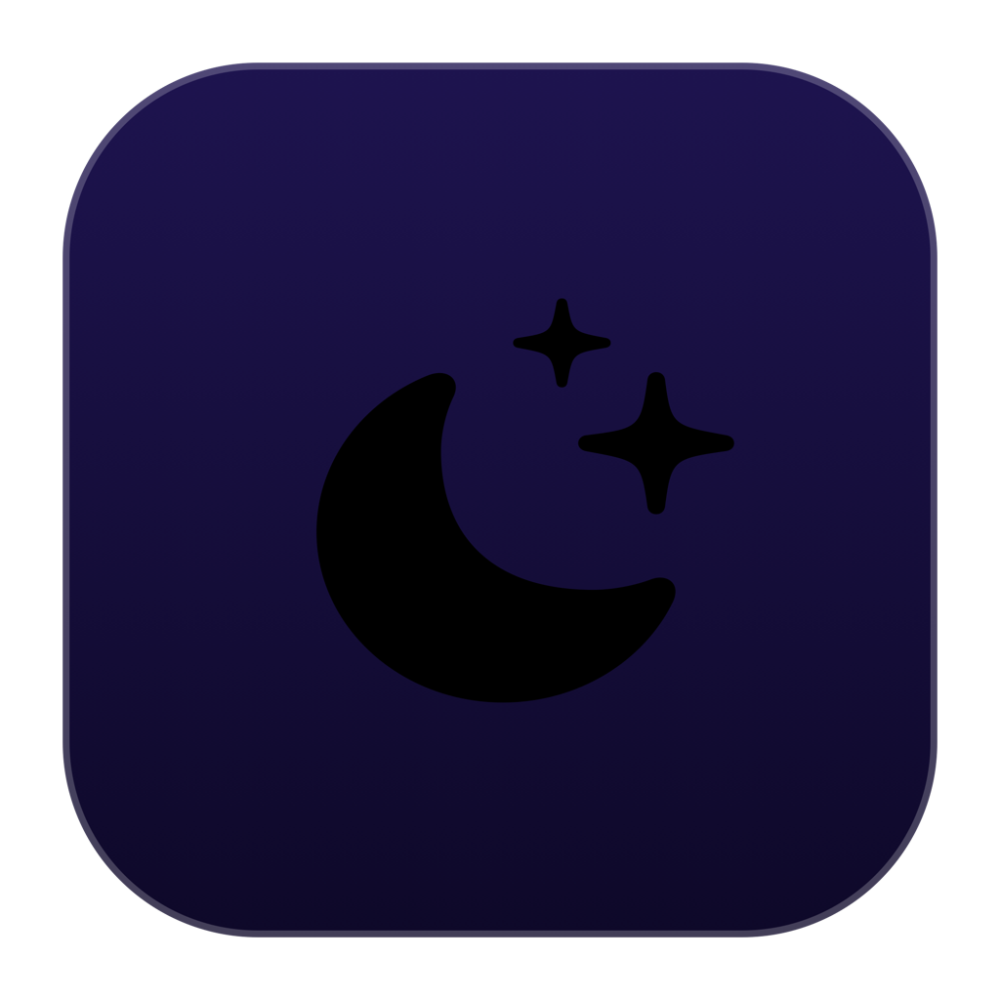

# 🌙 DisplaySleep

<p align="center">
  
</p>

<p align="center">
  <strong>A modern, Liquid Glass macOS menu bar app (Caffeinate-style) to instantly sleep displays using <code>pmset displaysleepnow</code>.</strong>
</p>

<p align="center">
  
  
  
  
</p>

---

## 💡 About / Sobre

Unlike putting the entire Mac to sleep (`pmset sleepnow`), **`pmset displaysleepnow`** immediately turns off display backlights and video signal while keeping all your background processes, downloads, renders, and builds running at full speed.

**DisplaySleep** lives quietly in your menu bar (just like *Caffeinate* or *Amphetamine*). Click it anytime to turn off your monitors in 1 click or set an automated countdown timer.

---

## ✨ Features / Recursos

- ⚡️ **Instant Sleep Action**: Big hero action card to run `/usr/bin/pmset displaysleepnow` with 1 click or shortcut (`⌘D`).
- ⏱️ **Smart Timer Presets**: Quick countdown chips for **15s, 30s, 1m, 5m, 15m, 30m, 1h**.
- 📊 **Live Menu Bar Feedback**: Displays the active countdown timer directly in the macOS menu bar (e.g. `🌙 04:30`) with an animated circular progress ring inside the popover.
- 🎨 **Customizable Menu Bar Icons**: Choose between Moon (`moon.fill`), Display (`display`), Sleep (`moon.zzz.fill`), or Bolt (`bolt.fill`).
- 🪟 **Liquid Glass Native UI**: Designed with SwiftUI materials (`.ultraThinMaterial`), subtle border gradients, and smooth spring animations.
- 🚀 **Launch at Login**: Native macOS `SMAppService` integration.
- 🔔 **Audio Feedback**: Subtle confirmation chime (*Tink*) when turning off displays.
- 💻 **Dormir ao Fechar a Tampa (Lid Sleep)**: Monitoramento nativo via IOKit para colocar o Mac em modo de repouso automaticamente ao fechar a tampa, mesmo com monitor externo ou dock conectado.
- 🪶 **Ultra Lightweight**: Pure native Swift app, zero third-party dependencies, < 20MB RAM, zero battery drain.

---

## 🏗️ Architecture & Community Inspirations

Built adhering to the modern Swift patterns highlighted by **Paul Solt** ([tweet](https://x.com/PaulSolt/status/2042716870512353294)):
- **Paul Hudson (@twostraws)**: Swift Observation framework (`@Observable`) and structured concurrency (`@MainActor`, async tasks with cancellation).
- **Antoine van der Lee (@twannl / SwiftLee)**: Liquid Glass aesthetics with macOS translucent materials and compiler optimizations (`-O -whole-module-optimization`).
- **Thomas Ricouard (@Dimillian)**: `MenuBarExtra(style: .window)`, clean window lifecycle management, and `LSUIElement` packaging.
- **Krzysztof Zabłocki (@merowing_)**: Clean decoupled architecture separating Services (`PowerService`), State (`DisplaySleepState`), and modular views.
- **AppCreator (Paul Solt)**: Agent-friendly build automation with standard `Makefile`.

---

## 🚀 Quick Start / Como Usar

### 1. Clone the repository:
```bash
git clone https://github.com/alenkpedro/DisplaySleep.git
cd DisplaySleep
```

### 2. Run immediately:
```bash
make run
```

### 3. Install to `~/Applications`:
```bash
make install
```

---

## 🛠️ Makefile Commands

| Command | Description |
|---|---|
| `make build` | Compiles the Swift binary and bundles `DisplaySleep.app` |
| `make run` | Builds and launches `DisplaySleep.app` in the menu bar |
| `make stop` | Quits any running instance |
| `make install` | Installs `DisplaySleep.app` into `~/Applications` |
| `make uninstall` | Removes `DisplaySleep.app` from `~/Applications` |
| `make clean` | Cleans the `build/` directory |

---

## ⌨️ Shortcuts (Inside Menu Window)

- `⌘D` or Click Primary Button: Turn off displays now.
- `⌘Q`: Quit DisplaySleep.

---

## 📄 License

This project is open-source under the [MIT License](LICENSE).
